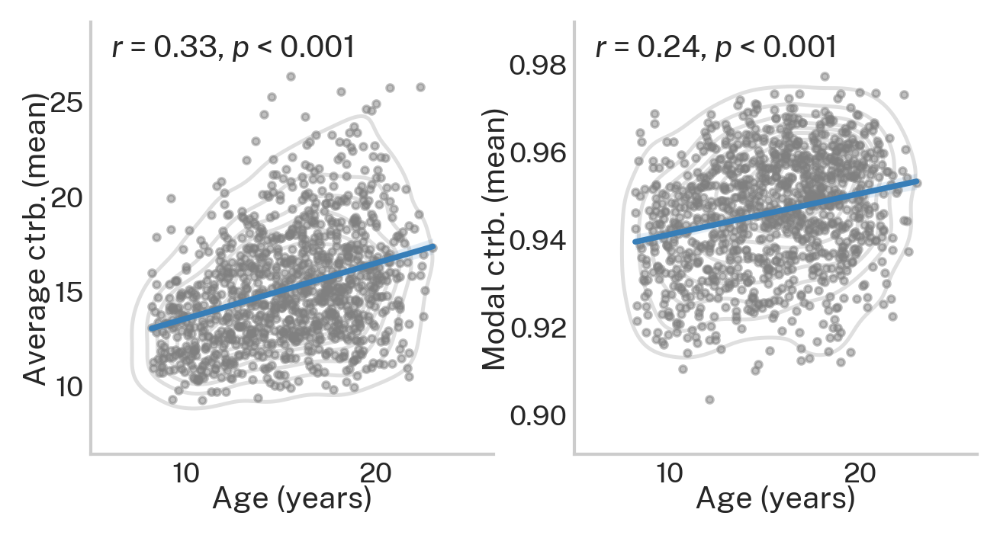

.. _age_effects_metrics:

Effect of development on average and modal controllability
==========================================================

.. note::
    :class: sphx-glr-download-link-note

    Relevant publication: `Tang et al. 2017 Nature Communications <https://www.nature.com/articles/s41467-017-01254-4.pdf>`_

In this example, we illustrate how average and modal controllability vary as a function of age in a developing sample.
The data used here are structural connectomes taken from the
`Philadelphia Neurodevelopmental Cohort <https://www.sciencedirect.com/science/article/pii/S1053811913008331?via%3Dihub>`_.

Here, our Python workspace contains subject-specific structural connectomes stored in ``A``, a ``numpy.array``
with 200 nodes along dimensions 0 and 1 and subjects along dimension 3.

.. code-block:: default

    print(A.shape)

.. code-block:: none

    Out:
    (200, 200, 1068)

We also have demographic data stored in ``df``, a ``pandas.dataframe`` with subjects along dimension 0.
Let's take a peek at age, which is stored in months.

.. code-block:: default

    print(df['ageAtScan1'].head())

.. code-block:: none

    Out:
    0    240
    1    253
    2    232
    3    231
    4    249
    Name: ageAtScan1, dtype: int64

With these data, we'll start by calculating average and modal controllability for each subject.

.. code-block:: default

    from network_control.metrics import ave_control, modal_control
    from network_control.utils rank_int, matrix_normalization
    from network_control.plotting import set_plotting_params, reg_plot
    set_plotting_params()

    n_nodes = A.shape[0] # number of nodes (200)
    n_subs = A.shape[2] # number of subjects (1068)

    # output containers for average and modal controllability
    ac = np.zeros((n_subs, n_nodes))
    mc = np.zeros((n_subs, n_nodes))

    # loop over subjects
    for i in np.arange(n_subs):
        a_norm = matrix_normalization(A[:, :, i])
        ac[i, :] = ave_control(a_norm)
        mc[i, :] = modal_control(a_norm)

Then we'll average over nodes to produce estimates of whole-brain average and modal controllability for each subject.

.. code-block:: default

    # mean over nodes
    ac_node_mean = np.mean(ac, axis=1)
    mc_node_mean = np.mean(mc, axis=1)

Lastly, we'll plot the correlation between age and each metric

.. code-block:: default

    f, ax = plt.subplots(1, 2, figsize=(5, 2.5))
    reg_plot(x=df['ageAtScan1']/12, y=ac_node_mean, xlabel='Age (years)', ylabel='Mean average ctrb.', ax=ax[0])
    reg_plot(x=df['ageAtScan1']/12, y=mc_node_mean, xlabel='Age (years)', ylabel='Mean modal ctrb.', ax=ax[1])
    plt.show()

The above figure shows that whole-brain average and modal controllability both increase throughout development.
This is consistent Tang et al. 2017 (see `Figure 2c <https://www.nature.com/articles/s41467-017-01254-4.pdf>`_
for average controllability).
