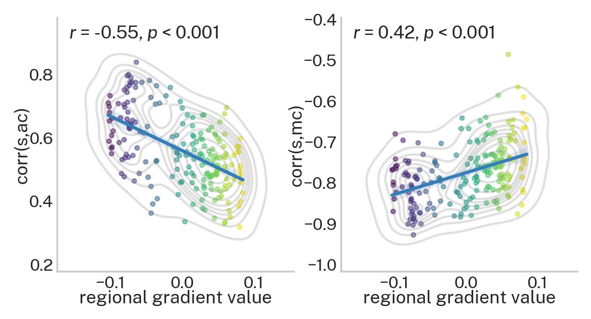

.. _gradient_metric_correlations:

Inter-metric coupling across the principal gradient of functional connectivity
==============================================================================

.. note::
    :class: sphx-glr-download-link-note

    Relevant publication: `Parkes et al. 2021 Biological Psychiatry <https://www.sciencedirect.com/science/article/pii/S0006322321011756>`_

In this example, we illustrate how the cross-subject correlations between weighted degree and average controllability,
as well as between weighted degree and modal controllability, vary as a function of the
`principal cortical gradient of functional connectivity <https://www.pnas.org/content/pnas/113/44/12574.full.pdf>`_.
The data used here are structural connectomes taken from the
`Philadelphia Neurodevelopmental Cohort <https://www.sciencedirect.com/science/article/pii/S1053811913008331?via%3Dihub>`_.

Here, our Python workspace contains subject-specific structural connectomes stored in ``A``, a ``numpy.array``
with 200 nodes along dimensions 0 and 1 and subjects along dimension 3.

.. code-block:: default

    print(A.shape)

.. code-block:: none

    Out:
    (200, 200, 1068)

We also have ``gradient``, a ``numpy.array`` that designates where each of the 200 regions in our parcellation are
situated along the cortical gradient.

.. code-block:: default

    print(gradient.shape)

.. code-block:: none

    Out:
    (200,)

With these data, we'll start by calculating weighted degree (strength), average controllability, and
modal controllability for each subject.

.. code-block:: default

    from network_control.metrics import node_strength, ave_control, modal_control
    from network_control.utils rank_int, matrix_normalization
    from network_control.plotting import set_plotting_params, reg_plot
    set_plotting_params()

    n_nodes = A.shape[0] # number of nodes (200)
    n_subs = A.shape[2] # number of subjects (1068)

    # output containers
    s = np.zeros((n_subs, n_nodes))
    ac = np.zeros((n_subs, n_nodes))
    mc = np.zeros((n_subs, n_nodes))

    # loop over subjects
    for i in np.arange(n_subs):
        a = A[:, :, i]
        # normalize subject's A matrix for a discrete-time system
        a_norm = matrix_normalization(a, version='discrete')
        s[i, :] = node_strength(a)
        ac[i, :] = ave_control(a_norm)
        mc[i, :] = modal_control(a_norm)

Next, we'll normalize the regional metric distributions (over subjects).

.. code-block:: default

    # normalize over subjects
    for i in np.arange(n_nodes):
        s[:, i] = rank_int(s[:, i])
        ac[:, i] = rank_int(ac[:, i])
        mc[:, i] = rank_int(mc[:, i])

Finally, for each region, we'll calculate the cross-subject correlation between strength and average/modal controllability.

.. code-block:: default

    # compute cross subject correlations
    corr_s_ac = np.zeros(n_nodes)
    corr_s_mc = np.zeros(n_nodes)

    for i in np.arange(n_nodes):
        corr_s_ac[i] = sp.stats.pearsonr(s[:, i], ac[:, i])[0]
        corr_s_mc[i] = sp.stats.pearsonr(s[:, i], mc[:, i])[0]

Plotting time! Below we illustrate how the above correlations vary over the cortical gradient spanning unimodal to
transmodal cortex.

.. code-block:: default

    f, ax = plt.subplots(1, 2, figsize=(5, 2.5))
    reg_plot(x=gradient, y=corr_s_ac, xlabel='regional gradient value', ylabel='corr(s,ac)', ax=ax[0], c=gradient)
    reg_plot(x=gradient, y=corr_s_mc, xlabel='regional gradient value', ylabel='corr(s,mc)', ax=ax[1], c=gradient)
    plt.show()

The above shows that the cross-subject correlations between strength and both average and modal controllability get
weaker as regions traverse up the cortical gradient. The results for average controllability can also be seen in
`Figure 3a <https://www.sciencedirect.com/science/article/pii/S0006322321011756>`_ of Parkes et al. 2021.
