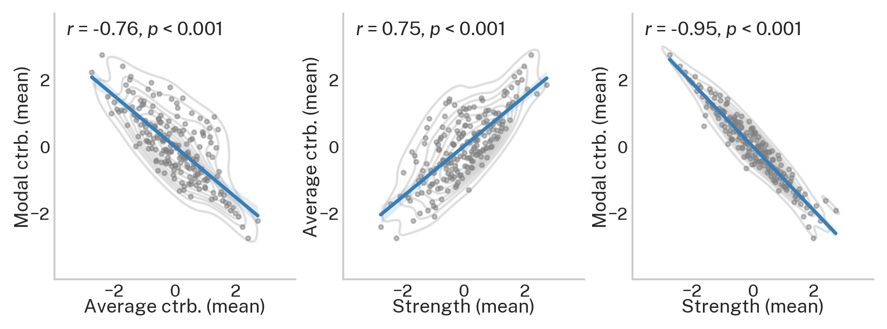

.. _metric_correlations:

Relationships between regional Network Control Theory metrics
=============================================================

.. note::
    :class: sphx-glr-download-link-note

    Relevant publication: `Gu et al. 2015 Nature Communications <https://www.nature.com/articles/ncomms9414.pdf>`_

In this example, we illustrate how average and modal controllability correlate to weighted degree and to each other.
The data used here are structural connectomes taken from the
`Philadelphia Neurodevelopmental Cohort <https://www.sciencedirect.com/science/article/pii/S1053811913008331?via%3Dihub>`_.

Here, our Python workspace contains subject-specific structural connectomes stored in ``A``, a ``numpy.array``
with 200 nodes along dimensions 0 and 1 and subjects along dimension 3.

.. code-block:: default

    print(A.shape)

.. code-block:: none

    Out:
    (200, 200, 1068)

With these data, we'll start by calculating weighted degree (strength), average controllability, and modal
controllability for each subject.

.. code-block:: default

    from network_control.metrics import node_strength, ave_control, modal_control
    from network_control.utils rank_int, matrix_normalization
    from network_control.plotting import set_plotting_params, reg_plot
    set_plotting_params()

    n_nodes = A.shape[0] # number of nodes (200)
    n_subs = A.shape[2] # number of subjects (1068)

    # output containers
    s = np.zeros((n_subs, n_nodes))
    ac = np.zeros((n_subs, n_nodes))
    mc = np.zeros((n_subs, n_nodes))

    # loop over subjects
    for i in np.arange(n_subs):
        a = A[:, :, i]
        a_norm = matrix_normalization(a)
        s[i, :] = node_strength(a)
        ac[i, :] = ave_control(a_norm)
        mc[i, :] = modal_control(a_norm)

Then we'll average over subjects to produce a single estimate of weighted degree, average controllability, and modal
controllability at each node.

.. code-block:: default

    # mean over subjects
    s_subj_mean = np.mean(s, axis=0)
    ac_subj_mean = np.mean(ac, axis=0)
    mc_subj_mean = np.mean(mc, axis=0)

    # normalize
    s_subj_mean = rank_int(s_subj_mean)
    ac_subj_mean = rank_int(ac_subj_mean)
    mc_subj_mean = rank_int(mc_subj_mean)

Lastly, we'll illustrate the correlations between metrics

.. code-block:: default

    f, ax = plt.subplots(1, 3, figsize=(7.5, 2.5))
    reg_plot(x=ac_subj_mean, y=mc_subj_mean, xlabel='Average ctrb. (mean)', ylabel='Modal ctrb. (mean)', ax=ax[0])
    reg_plot(x=s_subj_mean, y=ac_subj_mean, xlabel='Strength (mean)', ylabel='Average ctrb. (mean)', ax=ax[1])
    reg_plot(x=s_subj_mean, y=mc_subj_mean, xlabel='Strength (mean)', ylabel='Modal ctrb. (mean)', ax=ax[2])
    plt.show()

The above results are consistent with Gu et al. 2015
(see `Figure 2 <https://www.nature.com/articles/ncomms9414.pdf>`_).
