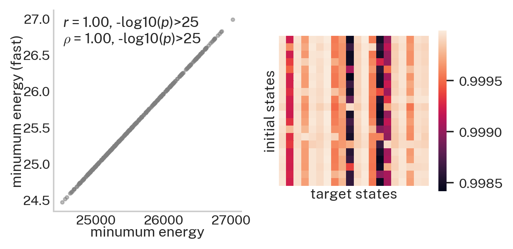

.. _minimum_energy_fast:

Different approaches to computing minimum control energy
========================================================

As discussed in Theory, there is more than one way to estimate the minimum control energy associated with a set of state
transitions. Here, we compare our standard approach to calculating minimum control energy to an approach that
approximates energy by leveraging X. **"why would I want to approximate minimum control energy this way?"** I hear you ask.
The answer is simple: speed! As you'll see below, the X approximation provides highly convergent estimates of energy
~30 times faster than the standard approach.

The data used here are structural connectomes taken from the
`Philadelphia Neurodevelopmental Cohort <https://www.sciencedirect.com/science/article/pii/S1053811913008331?via%3Dihub>`_.

Here, our Python workspace contains a single structural connectome stored in ``A``, a ``numpy.array``
with 200 nodes along dimensions 0 and 1.

.. code-block:: default

    print(A.shape)

.. code-block:: none

    Out:
    (200, 200)

Before we calculate minimum control energy, we first need to define some brain states. In this example, a brain state
is simply a set of ``n`` brain regions that are designated as "on" (activity = 1) while the rest of the brain is "off"
(activity = 0). Here, just for illustrative purposes, we define brain states arbitrarily by grouping rows/columns of our
adjacency matrix (:math:`\mathbf{A}`) into equally-sized non-overlapping subsets of regions.

.. code-block:: default

    # setup states
    n_nodes = A.shape[0]
    n_states = int(n_nodes/10)
    state_size = int(n_nodes/n_states)

    states = np.array([])
    for i in np.arange(n_states):
        states = np.append(states, np.ones(state_size) * i)
    states = states.astype(int)

The above code simply generates a vector of integers, stored in ``states``, that designates which of 20 states each
brain region belongs to. Owing to the fact that ``n_nodes`` equals 200 here, each state comprises 10 nodes. Note, no nodes
are assigned to multiple states.

.. code-block:: default

    print(states)

.. code-block:: none

    Out:
    [ 0  0  0  0  0  0  0  0  0  0  1  1  1  1  1  1  1  1  1  1  2  2  2  2
      2  2  2  2  2  2  3  3  3  3  3  3  3  3  3  3  4  4  4  4  4  4  4  4
      4  4  5  5  5  5  5  5  5  5  5  5  6  6  6  6  6  6  6  6  6  6  7  7
      7  7  7  7  7  7  7  7  8  8  8  8  8  8  8  8  8  8  9  9  9  9  9  9
      9  9  9  9 10 10 10 10 10 10 10 10 10 10 11 11 11 11 11 11 11 11 11 11
     12 12 12 12 12 12 12 12 12 12 13 13 13 13 13 13 13 13 13 13 14 14 14 14
     14 14 14 14 14 14 15 15 15 15 15 15 15 15 15 15 16 16 16 16 16 16 16 16
     16 16 17 17 17 17 17 17 17 17 17 17 18 18 18 18 18 18 18 18 18 18 19 19
     19 19 19 19 19 19 19 19]

So the first 10 nodes of ``A`` will belong to state 0, the next 10 to state 1, and so on and so forth. Using these states,
we'll first compute the minimum control energy required to transition between all possible pairs using our standard
approach, :func:`network_control.energies.minimum_energy`.

.. code-block:: default

    from network_control.utils import matrix_normalization
    from network_control.energies import minimum_energy

    # settings
    T = 1 # time horizon
    B = np.eye(n_nodes) # set all nodes as control nodes
    A = matrix_normalization(A) # normalize A matrix

    import time
    start_time = time.time() # start timer

    e = np.zeros((n_states, n_states, n_nodes))
    for i in np.arange(n_states):
        x0 = states == i # get ith initial state
        for j in np.arange(n_states):
            xf = states == j # get jth target state
            m_x, m_u, n_err = minimum_energy(A, T, B, x0, xf)
            e[i, j, :] = np.sum(np.square(m_u), axis=0)

    end_time = time.time() # stop timer
    elapsed_time = end_time - start_time
    print('time elapsed in seconds: {:.2f}'.format(elapsed_time)) # print elapsed time

.. code-block:: none

    Out:
    time elapsed in seconds: 30.17

The standard approach took ~30 seconds to calculate the control energy associated with completing 400 state
transitions. Now we'll compare that to our alternative approach, which can be accessed via
:func:`network_control.energies.minimum_energy_fast`.

In order to use this variant of minimum control energy, we first
have to use our :func:`network_control.utils.expand_states` function to convert ``states`` into a pair of boolean
matrices, ``x0_mat`` and ``xf_mat``, that together encode all possible pairwise state transitions.

.. code-block:: default

    from network_control.utils import expand_states
    x0_mat, xf_mat = expand_states(states)
    print(x0_mat.shape, xf_mat.shape)

.. code-block:: none

    Out:
    (200, 400) (200, 400)

The rows of ``x0_mat`` and ``xf_mat`` correspond to the nodes of our system and the columns correspond to the states we
defined above. Critically, ``x0_mat`` and ``xf_mat`` are paired; if you take the same column across both matrices
you will end up with the initial state (``x0_mat[:, 0]``) and the target state (``xf_mat[:, 0]``) that comprise
a specific **state transition**. Equipped with these state transition matrices, let's compute energy again!

.. code-block:: default

    from network_control.energies import minimum_energy_fast

    start_time = time.time() # start timer

    e_fast = minimum_energy_fast(A, T, B, x0_mat, xf_mat)
    e_fast = e_fast.transpose().reshape(n_states, n_states, n_nodes)

    end_time = time.time() # stop timer
    elapsed_time = end_time - start_time
    print('time elapsed in seconds: {:.2f}'.format(elapsed_time)) # print elapsed time

.. code-block:: none

    Out:
    time elapsed in seconds: 0.66

This time we managed to compute all of our transition energies in <1 second! So our X approximation is fast, but is it
equivalent?

.. code-block:: default

    import matplotlib.pyplot as plt
    import seaborn as sns
    from network_control.plotting import set_plotting_params, reg_plot
    set_plotting_params()

    # sum energy over regions
    e_sum = np.sum(e, axis=2)
    e_fast_sum = np.sum(e_fast, axis=2)

    # compute correlations across regional energy for each transition separately
    r = np.zeros((n_states, n_states))
    for i in np.arange(n_states):
        for j in np.arange(n_states):
            r[i, j] = sp.stats.pearsonr(e[i, j, :], e_fast[i, j, :])[0]

    # plot
    f, ax = plt.subplots(1, 2, figsize=(5, 2.5))

    # correlation between whole-brain energy across state transitions
    mask = ~np.eye(n_states, dtype=bool)
    indices = np.where(mask)
    reg_plot(x=e_sum[indices], y=e_fast_sum[indices], xlabel='minumum energy', ylabel='minumum energy (fast)', ax=ax[0],
             add_spearman=True, kdeplot=False, regplot=False)

    # energy correlated across regions for each state transition separately
    sns.heatmap(r, square=True, ax=ax[1], cbar_kws={"shrink": 0.80})
    ax[1].set_ylabel("initial states", labelpad=-1)
    ax[1].set_xlabel("target states", labelpad=-1)
    ax[1].set_yticklabels('')
    ax[1].set_xticklabels('')
    ax[1].tick_params(pad=-2.5)

In the above figure, the left subplot shows that the energy (summed over regions) associated with each of 400 state
transitions is correlated across the two approaches at :math:`r=1` and :math:`\rho=1`. Note, energy does differ by
several orders of magnitude. The right subplot shows how regional energy estimates correlate across approaches for each
state transition separately. Here, most :math:`r` values are :math:`> 0.98`.
