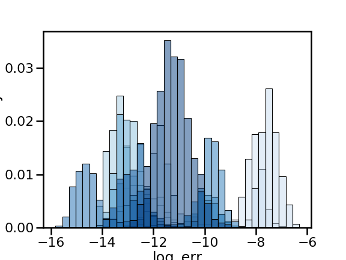
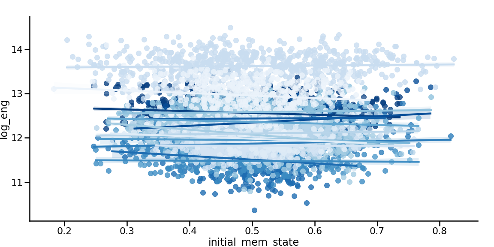

.. optimal_energy_ieeg_stim:

Replication from White Matter Network Architecture Guides Direct Electrical Stimulation through Optimal State Transitions
============================================================================================================================

Direct electrical brain stimulation is useful treatment for some neurological disorders (most famously, Parkinson's). However, 
we still don't really have a good way of predicting how stimulation at single region will influnce the rest of the brain. Here, 
we hypothesize that input from stimulation will spread linearly along white matter tracts to impact brain activity at distant regions. 
We use a dataset of combined iEEG, DWI, and stimulation data to simulate stimulation based on this hypothesis. 

In this demo, we're specifically going to ask if, given this model, it takes more stimulation energy to travel to more cognitively distant states.
We're going to define cognitive distance with the output from a classifier that guesses memory performance from brain states.

Data consist of one DWi structural adjacency matrix per dataset, and variable number of stimulation trials. Each stimulation trial includes the brain state before and after stimulation.

The data used here are taken from the
`Restoring Active Memory Project <http://memory.psych.upenn.edu/RAM>`_.

Let's take a look at the data:

.. code-block:: default

    import scipy.io as sio
    workdir = '/Users/stiso/Documents/Code/test_data/'
    subj = ['R1067P.PS1_set1','R1051J.PS1_set1','R1051J.PS1_set2.1', 'R1030J.PS1_set1', 'R1124J_1.PS2_set2',
            'R1124J_1.PS2_set3','R1124J_1.PS2_set1', 'R1150J.PS2_set1','R1150J.PS2_set2','R1170J_1.PS2_1_set1',
            'R1170J_1.PS2_1_set2','R1067P.PS1_set1','R1068J.PS1_set2.1','R1089P.PS2_set1','R1062J.PS1_set1',
            'R1173J.PS2_1_set1','R1066P.PS1_set1'];
    dat = sio.loadmat(f'{workdir}Trajectory_Data.{subj[0]}.mat')
    dat.keys()

.. code-block:: none

    Out:
    dict_keys(['__header__', '__version__', '__globals__', 'Electrode_ROI', 'Post_Freq_State', 'Post_Stim_Prob', 'Pre_Freq_State', 'Pre_Stim_Prob', 'Stim_Amp', 'Stim_Duration', 'Stim_Freq', 'Stim_Loc_Idx', 'Struct_Adj'])

Here, the first important variable is `Struct_Adj`, which is our structural adjacency matrix (A). Second is 'Pre_Freq_State', which is the band limited power in 8 frequencies, in all iEEG contacts, for each stimulation trial. This is our estimate of initial brain state (x(0)).
Because we have different frequency bands, we're basically going to average across all of them to get one energy estimate (an alternative to this would be to vectorize all the frequency bands into 1). 
The next important variable is `Pre_Stim_Prob`, which is the cognitive state at the start of every trial. High values indicate that 
someone is in a good cognitive state, or highly likely to encode a memory. The last useful variables are `Stim_Loc_Idx`, which tells us which contact were used to stimulate on each trial, and `Electrode_ROI`, 
Which helps us map between the iEEG contacts and the structural adjacency atlas.

If we're gong to use optimal control, we're missing a final state. We're going use a `good memory` state as the target. This is defined as
an average of the 5% of states with the best classifier predictions for memory performance. 

.. code-block:: default

    prefix = subj[0].split('_set')[0]
    target = sio.loadmat(f'{workdir}targets/{prefix}.mat')
    target.keys()

.. code-block:: none

    Out:
    dict_keys(['__header__', '__version__', '__globals__', 'ROI_target'])

Now that we know what our data are, we can set the parameters for our optimal control model. These specific parameters were chosen to minimize the
error of the optimal control calculation. 

You'll notice that there are a few new paramters here too - `B_mu` and `B_sigma`. Using optimal control to model stimulation with iEEG 
data presents some unitque problems that these parameters help address. The first challenge is that we want to have input concentrated at stimulation 
electrodes, but having a sparse B matrix leads to very high error. The second challenge is that we dont have iEEG contacts in every region of the brain, so we have to guess 
at what those regions activity levels are. We therefore set the power at all regions that dont have contacts to 1 (check the supplement for evidence that the exact number doesnt matter),
but we also don't want to waste a bunch of energy keeping these state values at 1 when we don't really care about them. To address both these
problems, we set diagonal entries in B without corresponding electrodes to very small values drawn from a normal distribution defined by `B_mu` and
`B_sigma`. This way, our B matrix is less sparse, and has lower error, and states that we dont have recordings for will be able to regulate themselves.

.. code-block:: default

    # balance between minimizing energy or minimizing distance from target state
    rho = .2  
    # time to go from initial to target state
    T = .7      
    # the number of time points the code spits out: T * 1000 + 1
    nTime = 701 
    gamma = 4
    # to try and simulate stimuluation, we're gonna weight the B matrix
    B_mu = .0005 
    B_sigma = .00005

Now we're ready to get the optimal input required to go from any given starting state, toa good memory state. We expect that its going to take more 
energy to go from bad to good states than good to good states.

.. code-block:: default

    from network_control.utils import matrix_normalization
    from network_control.energies import optimal_input
    import numpy as np
    import pandas as pd
    np.random.seed(0)

    # intiialize final data strcutre
    energies = pd.DataFrame(columns=['energy', 'condition', 'subject', 'trial', 'error'])

    for i,s in enumerate(subj):
        prefix = subj[0].split('_set')[0]
        # load in data
        dat = sio.loadmat(f'{workdir}Trajectory_Data.{s}.mat')
        target = sio.loadmat(f'{workdir}targets/{prefix}.mat')
        
        # subject specific constants
        # number of stim trials for this set
        nTrial = np.size(dat['Post_Freq_State'],0)
        # number of nodes/regions in the atlas we are using - one of the complications of this project is that we 
        # dont have iEEG/state data for every regions of the atlas
        nROI = np.size(dat['Post_Freq_State'],1) 
        # number of bands
        nFreq = np.size(dat['Post_Freq_State'],2)
        # these are the regions with contacts
        elec_idx = np.sum(dat['Post_Freq_State'][:,:,0],0) != 0 
        ROI_idx = [not x for x in elec_idx]
        # number of contacts
        nElec = sum(elec_idx)
        # stim contacts
        stim_idx = [x[0][0] for x in dat['Stim_Loc_Idx']]

        # which regions we want to constrain the state of
        S = np.eye(nROI)
        
        # scale A matrix (continuous)
        # this variable will be the same for both datasets
        A = dat['Struct_Adj'] 
        A = matrix_normalization(A, c=gamma, version='continuous')

        # get optimal input and trajectory for each trial
        # each participant has a "good memory state", as determined by a linear classifier trained on memory performance
        xf = target['ROI_target']
        # this will take a while
        for t in range(nTrial):
            # get stim contacts
            e = stim_idx[t]
            
            # set sparse B matrix - ultimate goal is to have the majority of input be at the stim elecs
            # first, we set small input everywhere
            B = np.eye(nROI) * np.random.normal(loc=B_mu, scale=B_sigma, size=(1, nROI)) 
            # then we add 0s to all the areas whos activity we know
            B[elec_idx,elec_idx] = 0 
            # then, we add big numbers to the stim elecs
            for c in e:
                B[c,c] = 1

            # get states
            x0 = np.squeeze(dat['Pre_Freq_State'][t,:,:])

            # add 1s to regions without elecs
            x0[ROI_idx,:] = 1

            # concatenate across frequency bands
            u = np.zeros((nROI,nTime,nFreq))
            err = np.zeros((1,nFreq))
            for f in range(nFreq):
                _,curr_u, curr_err = optimal_input(A,T,B,x0[:,f],xf[:,f],rho,S)

                curr_u = curr_u.T
                err[:,f] = curr_err

                u[:,:,f] = curr_u
            
            # get summary of optimal input
            # we incorporated the B matrix into our input summary because of the weighting
            # we use the term energy to be consistent with other literature, but in some sense this is a different summary statistic
            u = sum(np.linalg.norm(u.T*np.diag(B),axis=(0,2)))/nTime

            # average over frequencies
            err = np.mean(err)

            # add to data frame (averaged over freqs)
            curr = pd.DataFrame({'energy':[np.mean(u)],
                                'initial_mem_state': dat['Pre_Stim_Prob'][0][t],
                                'subject':[s],
                                'trial':[t],
                                'error':[err]})
            energies = pd.concat([energies,curr],sort=False)

    energies['log_eng'] = np.log(energies['energy']) 
    energies['log_err'] = np.log(energies['error'])   

After a long time this will finish. Let's first demonstrate that we have small error, since we went through a lot of trouble to make sure that was the case.

.. code-block:: default

    import seaborn as sns
    import matplotlib.pyplot as plt
    %matplotlib inline
    sns.set_context('poster')

    energies['log_eng'] = np.log(energies['energy']) 
    energies['log_err'] = np.log(energies['error']) 
    fig,ax = plt.subplots(1,1,figsize=(8,6))
    sns.histplot(energies, x='log_err', hue='subject', stat='probability', 
                ax=ax, palette='Blues_r', legend=False)

All the different datasets are in different shades of blue. And we can see here that everyone has low error values. 
Now lets check our actual hypothesis.

.. code-block:: default

    sns.lmplot(data=energies, y='log_eng', x = 'initial_mem_state', hue = 'subject', palette='Blues_r',
          height=8, aspect=2, legend=False)
    plt.legend(bbox_to_anchor=(1.05, 1), loc=2, borderaxespad=0.)

This plot looks a little different from the one in the paper because we don't normalize the output. But as we can see, 
for most participants, transitions to good memory states require more energy when starting from a poorer memory state. 
In the paper, we show that the initial memory state explains more variane than the Euclidean distance between states as well.

