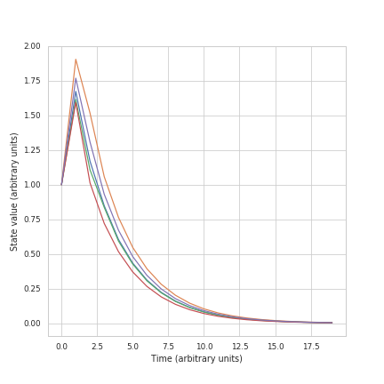
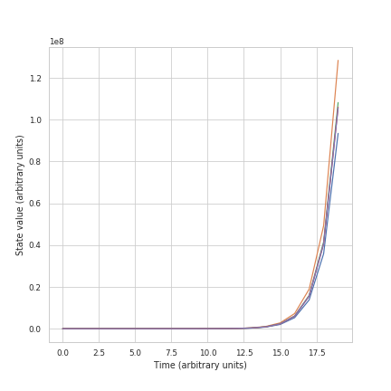

.. _gettingstarted:

Getting Started
==============================

Introduction to Network Control
-------------------------------------

Classically, many neuroimaging studies have been interested in how the brain can be driven to specific, diverse patterns of activity.
Network control theory is a powerful tool from physical energineering sciences that can provide instight into these questions. Network 
control theory provides a specific, dynamical equation that defines how the activity of the brain will spread along white matter connections
in response to some input. Important to these tools is the definition of the system 9here, the brain) as network, with nodes connected by edges, and
defined by an adjacency matrix A. In human neuroimaging, much of the application of these tools is divided into two categories: metrics and energies.
Metrics are statistics of a structural brain network, or node in the network that summarise information about control to many, nonspecific states.
Energies, on the other hand, provide quantification of how easily the network can transition between two specific states. For a more detailed
introduction, see :ref:`theory`.

network_control is compact python toolbox that implements commonly used analyses from network control theory in human neuroimaging in Python.
It requires only numpy and scipy to install. In this overview, we will walk through some of the bsic functions, and important considerations
for using network control theory. The steps below will help you to get
started. If you haven't done so yet, we recommend you install the package (:ref:`install_page`) so you can follow along with the examples. 

Calculating control statistics and energies
--------------------------------------------------------

We can start by intializing a random adjacency matrix (A) the will serve as our structural connectivity matrix.
The matrix A defines the possible paths of activity spread for our dynamical system (the brain). The dynamics of our system will evolve according to the equation x(t+1) = Ax(t) + Bu(t)
where x is the state (or regional brain activity) of the system over time, u is the input to the system, and B defines which nodes (or brain regions) receive input:

.. tabs::

   .. code-tab:: py

        >>> import numpy as np

        >>> # initialize matrix
        >>> np.random.seed(28)
        >>> A = np.random.rand(5,5)
        array([[0.72901374, 0.5612396 , 0.12496709, 0.39759237, 0.78130821],
       [0.51099298, 0.18269336, 0.85351288, 0.95537189, 0.98421347],
       [0.19270097, 0.9707951 , 0.23480835, 0.02635385, 0.94606034],
       [0.92172485, 0.29397577, 0.1662737 , 0.39542284, 0.51066973],
       [0.30803723, 0.42956883, 0.83006941, 0.56239357, 0.83088831]])

Most work will first scale this matrix to be stable before starting any network control analyses. If our matrix is stable, it means that 
after adding a single unit of input, the activity will spread but eventually die down, and the system will reach a stable state. An unstable
system would have states that continued growing forever. Practically this is done by dividing all elements of the matrix by some positive constant 
c, times the largest eigenvalue and subtracting the identity. The exact number that you scale your matrix by can be thought of as a free parameter, and it is
generally a good idea to check that your results hold for a couple different vaues. Scaling can be done using the `matrix_normalization` function:

.. tabs::

   .. code-tab:: py

        >>> from network_control.utils import matrix_normalization

        >>> A = matrix_normalization(A, c=1)
        array([[0.18918473, 0.14564604, 0.03242993, 0.10317831, 0.20275555],
       [0.13260665, 0.04741035, 0.22149322, 0.24792643, 0.25541104],
       [0.0500074 , 0.25192887, 0.06093459, 0.00683903, 0.24551001],
       [0.23919476, 0.076289  , 0.04314932, 0.1026153 , 0.13252276],
       [0.07993805, 0.11147645, 0.21540946, 0.1459455 , 0.21562197]])

We can visualize the behavior of a stable and unstable matrix by simulating the systems response to small amount of input. These 
simulations can be run using the `sim_state_eq` function"

.. tabs::

   .. code-tab:: py

        >>> from network_control.energies import sim_state_eq
        >>> import matplotlib.pyplot as plt

        >>> U = np.zeros((5,20)) # the input to the system
        >>> U[:,0] = 1# impulse, 1 energy at the first time point
        >>> B = np.eye(5)
        >>> x0 = np.ones((5,1))
        >>> x = sim_state_eq( A, B, x0, U)
        >>> fig,ax = plt.subplots(1,1, figsize=(6,6))
        >>> ax.plot(np.squeeze(x.T))
        >>> plt.show()

Let's see what happen with an unstable matrix:

.. tabs::

   .. code-tab:: py

        >>> A_unstable = np.random.rand(5,5)
        >>> x = sim_state_eq( A_unstable, B, x0, U)
        >>> fig,ax = plt.subplots(1,1, figsize=(6,6))
        >>> ax.plot(np.squeeze(x.T))
        >>> plt.show()

Now that our matrix is scaled, we're ready to calculate some control metrics. The first metric included in the package is
average controllability. This metric represents an upper bound on the energy required to transition between any two states.
Average contrallability can be calculated using the `ave_control` function:

.. tabs::

   .. code-tab:: py

        >>> from network_control.matrics import ave_control

        >>> labeling = load_parcellation('schaefer', scale=400, join=True)
        >>> m = load_group_fc('schaefer', scale=400)
        >>> m.shape
        (400, 400)

The second metric included is modal controllability. Modal controlability tells you how wellmuch changing activity at a single node will impact all modes
of your system. Modes are similar to time scales, and some modes are faster or slower than others. Modal controllability is weighted towards 
the faster modes, which have less influece on average controllability. Modal controllability can be calculated with `modal_control` :

.. tabs::

   .. code-tab:: py

        >>> from network_control.matrics import ave_control

        >>> # Build gradients using diffusion maps and normalized angle
        >>> gm = GradientMaps(n_components=2, approach='dm', kernel='normalized_angle')

        >>> # and fit to the data
        >>> gm.fit(m)
        GradientMaps(alignment=None, approach='dm', kernel='normalized_angle',
                     n_components=2, random_state=None)

        >>> # The gradients are in
        >>> gm.gradients_.shape
        (400, 2)

Let's say that we now want to know how well our system can transition between two specific states. We can calculate both the mininmum amount of 
energy that would need to be input into our system to get between a starting state (xi) and a final state (xf) using the function `minimum_control`:

.. tabs::

   .. code-tab:: py

        >>> from network_control.energies import mini
        >>> from brainspace.utils.parcellation import map_to_labels

        >>> # map to original size
        >>> grad = map_to_labels(gm.gradients_[:, 0], labeling, mask=labeling != 0,
        ...                      fill=np.nan)

        >>> # Plot first gradient on the cortical surface.
        >>> plot_hemispheres(surf_lh, surf_rh, array_name=grad, size=(800, 200))

The function returns a matrix (u) that gives the energy at each time point for each node. Typically, to summarize over these values, you will
calculate the area under the curve, or sum of squared values divded by the number of time points, for each node. The same goes for the state
values at every time point (x). The function also returns an error value, which the numerical error associated with the calculation of energy.
Have large A matrices, sparse B matrices, and large T values will increase this value. It is genreally a good idea to make sure you error values
are consistent with those reported in other papers. Let's look at an example that will lead to higher error:

.. tabs::

   .. code-tab:: py

        >>> from network_control.energies import mini
        >>> from brainspace.utils.parcellation import map_to_labels

        >>> # map to original size
        >>> grad = map_to_labels(gm.gradients_[:, 0], labeling, mask=labeling != 0,
        ...                      fill=np.nan)

        >>> # Plot first gradient on the cortical surface.
        >>> plot_hemispheres(surf_lh, surf_rh, array_name=grad, size=(800, 200))

Note that a faster version of minimal energy is also included (`minimum_energy_fast`) that only returns the energy.

Minimal energy gives the smallest possible energy required to transition between two states. However, the system can potentially pass through
extremely large, or 'far away' states to accomplish this energy minimization. If you want to constrain your system ot stay close to your final
state, you can use the `optimal_control` function:

.. tabs::

   .. code-tab:: py

        >>> from network_control.energies import mini
        >>> from brainspace.utils.parcellation import map_to_labels

        >>> # map to original size
        >>> grad = map_to_labels(gm.gradients_[:, 0], labeling, mask=labeling != 0,
        ...                      fill=np.nan)

        >>> # Plot first gradient on the cortical surface.
        >>> plot_hemispheres(surf_lh, surf_rh, array_name=grad, size=(800, 200))

Optimal control takes an additional parameter, rho. This parameter scales how important energy minimization is relative to staying 'close' to 
your target state. If rho is infinity, topimal control becomes the same as minimum control

That concludes this getting started section. For more full examples see :ref:`examples`.
