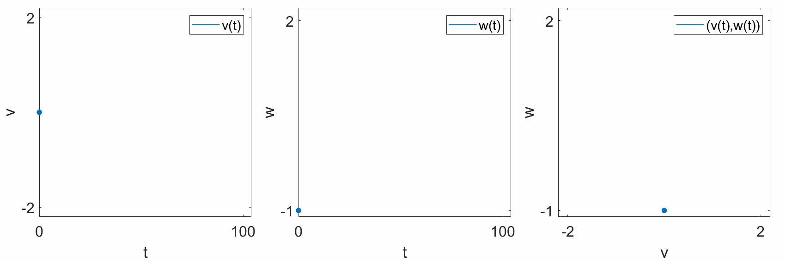
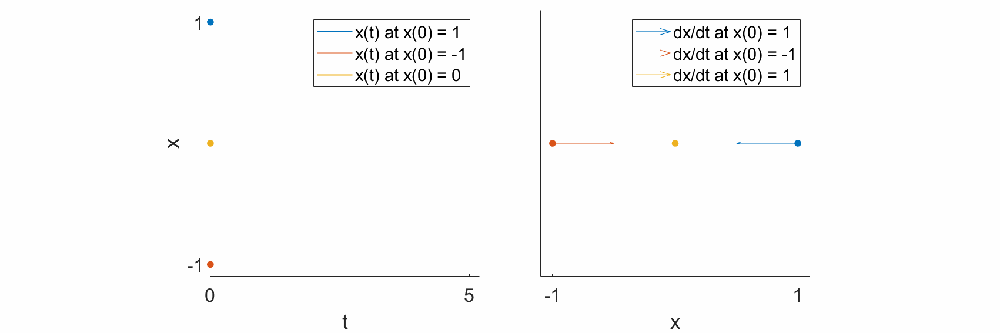
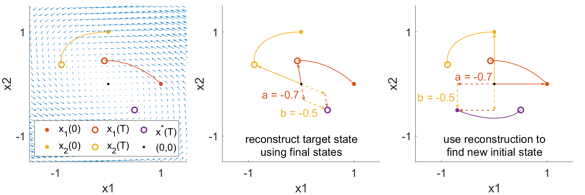

.. _theory:

Theory
-------

When we talk about the "control" of a system, we broadly refer to some input or change to the system that alters its behavior in a desired way. To more precisely discuss control, we first have to discuss the object that is being controlled: the system. In the network control framework, what is being controlled is a **dynamical system**.

|
|

What is a Dynamical System?
==============================
As per the Wikipedia article on dynamical systems: "a `dynamical system <https://en.wikipedia.org/wiki/Dynamical_system>`_ is a system in which a function describes the time dependence of a point in geometrical space." We're going to reword this sentence a bit to say: "a **dynamical** system is a system whose **states** evolve **forward in time** in **geometric space** according to a **function**." Let's unpack this sentence a bit.

"A dynamical system is a system"
_______________________________________
The word "dynamic" (change) is used in contrast to "static" (no change). If a system is dynamic, it changes over time. That's all well and good, but what exactly is changing about the system? The answer is: the **states**.

"whose states"
______________________
A state is just a complete description of a system. Take for example a train. If I know the position :math:`x` of the train from some station, then I know exactly where the train is. It can only move forwards or backwards along the track, and every position along that track has an associated position :math:`x`, or *state*. As another example, in a computer, if I know the voltage of every single transistor, then I have a complete description of the computer, and I can unambiguously describe all possible states of the computer using these transistor voltages (states).

"evolve forward in time"
__________________________
When we say dynamic (states are changing), we mean to say that the states are changing forward in time. Hence, *time* is a very important concept in dynamical systems. The field of dynamical systems broadly concerns itself with the question "how do the system states evolve forward in time?"

"in geometric space"
__________________________
When we say "geometric," we *usually* mean the colloquial usage of the word. That is, Euclidean space. We live in 3-dimensional Euclidean space, where every point is described by 3 coordinates: :math:`(x,y,z)`. In a dynamical system, there is no need to restrict ourselves to 3 dimensions. In the train example, we can represent the position of the train along the track, :math:`x`, on a number line. Even if the track itself is not straight, we can "straighten out" the track to form a 1-dimensional line. As another exmple, the FitzHugh-Nagumo model is a 2-dimensional simplification of a Hodgkin-Huxley neuron, with two states, :math:`v` and :math:`w`. We can plot these states separately over time (left,center), or we can plot them together in a 2-dimensional space, where each axis represents either :math:`v` or :math:`w` (right). 

"according to a function."
_______________________________
Now, just because a system has states and evolves forward in time does not make it a dynamical system. For a system to be dynamical, it must evolve forward in time according to a function. This requirement is precisely where *differential equations* enters the fray. Specifically, the function that the dynamical system uses to evolve forward in time is a differential equation. For example, the FitzHugh-Nagumo model evolves according to the functions

.. math::
    \frac{\mathrm{d}v}{\mathrm{d}t} &= v - \frac{v^3}{3} - w + 0.5\\
    \frac{\mathrm{d}w}{\mathrm{d}t} &= \frac{1}{12.5} (v + 0.8 - 0.7w)\\

|
|

What is a Differential Equation?
=======================================
As per the Wikipedia definition: "a `differential equation <https://en.wikipedia.org/wiki/Differential_equation>`_ is an equation that relates one or more functions and their derivatives." Let's break down this sentence.

"A differential equation is an equation"
_________________________________________
An equation is a relation that equates the items left of the equal sign to the items right of the equal sign. For example, for a right triangle with side lengths :math:`a,b` and hypotenuse length :math:`c`, the Pythagorean equation is:

.. math::
    c^2 = a^2 + b^2

This equation has thre evariables that are related by one equation. Hence, if I fix :math:`a` and :math:`b,` then I know what :math:`c` has to be for the triangle to be a right triangle.

"that relates one or more functions and their derivatives."
________________________________________________________________
A derivative is an operation that tells us how a variable changes. For example, if :math:`c` is a variable measuring the side length of the triangle, then :math:`\mathrm{d}c` is a variable measuring the *change* in that side length. Typically, these change variables come as ratios to measure how quickly one variable changes with respect to another variable. For example, :math:`\frac{\mathrm{d}c}{\mathrm{d}a}` is a ratio between a change in :math:`c` with respect to a change in :math:`a`. 

| 
|

Dynamical Systems & Differential Equations
================================================
Recall the two statements that we have made thus far:

* Dynamical system: a system whose states evolve forward in time in geometric space according to a **function**
* Differential equation: an equation that relates one or more functions and their **derivatives**.

Hence the relationship between these two is that the **function** is a differential equation of **derivatives**. In particular, the derivative of the system states with respect to time.

In the differential equations of a dynamical system, the left-hand side contains a derivative of the state with respect to time, :math:`\frac{\mathrm{d}x}{\mathrm{d}t}.` The right-hand side contains a function of the states, :math:`f(x).` Hence, generally speaking, a dynamical equation looks like

.. math::
    \frac{\mathrm{d}x}{\mathrm{d}t} = f(x).

As a specific example, let's look at the dynamical equation

.. math::
    \frac{\mathrm{d}x}{\mathrm{d}t} = -x,

and let's see what happens at some specific states.

* If :math:`x=1,` then :math:`\frac{\mathrm{d}x}{\mathrm{d}t} = -1.` In other words, if the system state is at 1, then the change in state with respect to time is negative, such that the state moves towards 0.
* If :math:`x=-1,` then :math:`\frac{\mathrm{d}x}{\mathrm{d}t} = 1.` In other words, if the system state is at -1, then the change in state with respect to time is positive, such that the state moves towards 0.
* If :math:`x=0,` then :math:`\frac{\mathrm{d}x}{\mathrm{d}t} = 0.` The system does not change, and the state remains at 0.

If we plot the trajectories :math:`x(t)` over time (left), we see that, as predicted, the trajectories all move towards :math:`0` (left), and that the change in the state, :math:`\frac{\mathrm{d}x}{\mathrm{d}t},` also points towards :math:`0` (right).

Hence, the dynamical equation for a system describes the evolution of the state at every point in state space. To visualize this description in 2-dimensions, let us revisit the equations for the FitzHugh-Nagumo model,

.. math::
    \frac{\mathrm{d}v}{\mathrm{d}t} &= v - \frac{v^3}{3} - w + 0.5\\
    \frac{\mathrm{d}w}{\mathrm{d}t} &= \frac{1}{12.5} (v + 0.8 - 0.7w),

and at every point :math:`(v,w)`, we will draw an arrow pointing towards :math:`(\mathrm{d}v/\mathrm{d}t, \mathrm{d}w/\mathrm{d}t).`

.. image:: ./fig_vector_field.gif
   :align: center

We observe that at every point in the state space, we can draw an arrow defined by the dynamical equations. Additionally, we observe that the evolution of the system states, :math:`v(t)` and :math:`w(t),` follow these arrows. Hence, the differential equations define the flow of the system states over time.

For convenience, we will name all of our state varibles :math:`x_1,x_2,\dotsm,x_N,` and collect them into an :math:`N`-dimensional vector :math:`\mathbf{x}.` For an additional convenience, instead of always writing the fraction :math:`\frac{\mathrm{d}x}{\mathrm{d}t},` we will use :math:`\dot{x}` to represent the time derivative of :math:`x.`

|
|

Linear Dynamics
===============
Now that we have a better idea of what a dynamical system is, we would like to move on to control. However, there is a fundamental limitation when attempting to control a system, which is that we do not know how the system will naturally evolve. At any given state, :math:`\mathbf{x}(t),` we can use the dynamical equations to know where the state will *immediately* go, :math:`\frac{\mathrm{d}\mathbf{x}(t)}{\mathrm{d}t}.` However, we generally cannot know where the state will end up after a *finite* amount of time, at :math:`\mathbf{x}(t+T).` This problem extends to any perturbation we perform on the system, where we cannot know how the perturbation will affect the state after a finite amount of time.

However, there is a class of dynamical systems where we can know both where the states will end up, and how a perturbation will change the states after a finite amount of time. These systems are called `linear time-invariant systems <https://en.wikipedia.org/wiki/Linear_time-invariant_system>`_, or LTI systems. 

scalar LTI system
_____________________________

We have already looked at an example of an LTI system, namely,

.. math::
    \frac{\mathrm{d}x}{\mathrm{d}t}  = -x.

We can make this system a bit more general, and look at

.. math::
    \frac{\mathrm{d}x}{\mathrm{d}t} = ax,

where :math:`a` is a constant real number. Using some basic calculus, we can actually solve for the trajectory :math:`x(t).` First, we divide both sides by :math:`x` and multiply both sides by :math:`a` to match terms,

.. math::
    \frac{1}{x}\mathrm{d}x = a\mathrm{d}t.

Then, we integrate both sides,

.. math::
    \int \frac{1}{x} \mathrm{d}x &= \int a \mathrm{d}t + c\\
    \ln|x| &= at + c.

Finally, we exponentiate both sides to pull out :math:`x(t)`:

.. math::
    x(t) = Ce^{at},

where the constant :math:`C` is the initial condition, :math:`C = x(0).` Hence, we can write our final trajectory as

.. math::
    x(t) = x(0) e^{at},

which tells us exactly what the state of our system will be at every point in time. This knowledge of the state at every point in time is generally very difficult to obtain for nonlinear systems. To verify that this trajectory really is a solution to our dynamical equation, we can substitute it back into the differential equation, and check if the left-hand side equals the right-hand side. To evaluate the left-hand side, we must take the time derivative of :math:`e^{at},` which we can do by writing the exponential as a Taylor series, such that :math:`e^{at} = \sum_{k=0}^\infty \frac{(at)^k}{k!}.` Then taking the derivative of each term with respect to time, we get

.. math::
    \frac{\mathrm{d}}{\mathrm{d}t}e^{at} &= \frac{\mathrm{d}}{\mathrm{d}t} \left( 1 + \frac{at}{1!} + \frac{a^2t^2}{2!} + \frac{a^3t^3}{3!} + \dotsm + \frac{a^kt^k}{k!} + \dotsm\right)\\
    &= 0 + \frac{a}{1!} + 2\frac{a^2t}{2!} + 3\frac{a^3t^2}{3!} + \dotsm + k\frac{a^lt^{k-1}}{k!} + \dotsm\\
    &= a\left(1 + \frac{at}{1!} + \frac{a^2t^2}{2!} + \dotsm + \frac{a^kt^k}{k!}\right)\\
    &= ae^{at}.

Hence, the derivative of :math:`e^{at}` is equal to :math:`ae^{at},` such that the left-hand side of the dynamical equation equals the right-hand side.

vector LTI system
_________________________
Of course, systems like the brain typically have many states, and writing down the equations for all of those states would be quite tedious. Fortunately, we can obtain all of the results in scalar LTI systems for vector LTI systems using matrix notation. In matrix form, the state-space LTI dynamics are written as

.. math::
    \underbrace{\begin{bmatrix} \dot{x}_1\\\dot{x}_2\\\vdots\\\dot{x}_N \end{bmatrix}}_{\dot{\mathbf{x}}} = \underbrace{\begin{bmatrix} a_{11} & a_{12} & \dotsm & a_{1N}\\ a_{21} & a_{22} & \dotsm & a_{2N}\\ \vdots & \vdots & \ddots & \vdots\\ a_{N1} & a_{N2} & \dotsm & a_{NN} \end{bmatrix}}_{A} \underbrace{\begin{bmatrix} \dot{x}_1\\\dot{x}_2\\\vdots\\\dot{x}_N \end{bmatrix}}_{\mathbf{x}},

or, more compactly, as 

.. math::
    \dot{\mathbf{x}} = A\mathbf{x}.

Here, :math:`a_{ij}` is the element in the :math:`i`-th row and :math:`j`-th column of matrix :math:`A,` and represents the coupling from state :math:`j` to state :math:`i.` 

Now, it might be too much to hope that the solution to the vector LTI system is simply a matrix version of the scalar form, perhaps something like :math:`\mathbf{x}(t) = e^{At}\mathbf{x}(0).` However, this form is precisely the solution to the vector dynamical equation! Exactly as in the scalar version, we can write the *matrix exponential*, :math:`e^{At},` as a Taylor series such that :math:`e^{At} = \sum_{k=0}^\infty \frac{(At)^k}{k!},` and again take the time derivative of each term to get

.. math::
    \frac{\mathrm{d}}{\mathrm{d}t}e^{At} &= \frac{\mathrm{d}}{\mathrm{d}t} \left( 1 + \frac{At}{1!} + \frac{A^2t^2}{2!} + \frac{A^3t^3}{3!} + \dotsm + \frac{A^kt^k}{k!} + \dotsm\right)\\
    &= 0 + \frac{A}{1!} + 2\frac{A^2t}{2!} + 3\frac{A^3t^2}{3!} + \dotsm + k\frac{A^lt^{k-1}}{k!} + \dotsm\\
    &= A\left(1 + \frac{At}{1!} + \frac{A^2t^2}{2!} + \dotsm + \frac{A^kt^k}{k!}\right)\\
    &= Ae^{at}.

Hence, the trajectory of a vector LTI system is given simply by

.. math::
    \mathbf{x}(t) = e^{At}\mathbf{x}(0).

In general, :math:`e^{At}` is called the *impulse response* of the system, because for any impulse :math:`\mathbf{x}(0),` the impulse response tells us precisely how the system will evolve.

what makes a system linear?
_________________________________
Until now, we have written down several examples of systems that we have called linear. Drawing on our prior coursework in linear algebra, we recall that the adjective *linear* is used to describe a particular property of some operator :math:`f(\cdot)` acting on some objects :math:`x_1,x_2.` That is, if 

.. math::
    y_1 = f(x_1) ~\mathrm{and}~ y_2 = f(x_2),

then :math:`f(\cdot)` is linear if

.. math::
    a y_1 + b y_2 = f(a x_1 + b x_2 ).

Colloquially, if an operator is linear, then it *adds distributively*. Scaling the input by a constant scales the output by the same constant, and the sum of two inputs yields the sum of the outputs. 

So then, what do we mean when we say that our dynamical system is linear? In this case, we mean that the *impulse response* is linear. That is, for two initial conditions, :math:`\mathbf{x}_1(0), \mathbf{x}_2(0),` if

.. math::
    \mathbf{x}_1(t) = e^{At}\mathbf{x}_1(0) ~\mathrm{and}~ \mathbf{x}_2(t) = e^{At}\mathbf{x}_2(0),

then 

.. math::
    a \mathbf{x}_1(t) + b \mathbf{x}_2(t) = e^{At}(a\mathbf{x}_1(0) + b\mathbf{x}_2(0)),

which is true by the distributive property. 

While this property might not seem so impressive at first glance, the implications are actually quite powerful. Specifically, this linearity allows us to write all possible trajectories of our system as a simple weighted sum of initial conditions. Hence, rather than having to simulate all initial states to see if we reach a particular final state, we can reconstruct the initial state that yields a desired final state. To demonstrate, consider the following simple 2-dimensional system

.. math::
    \begin{bmatrix} \dot{x}_1\\ \dot{x}_2\end{bmatrix} = \begin{bmatrix} -1 & -2\\ 1 & 0\end{bmatrix},

and two initial conditions

.. math::
    \mathbf{x}_1(0) = \begin{bmatrix}1\\0\end{bmatrix}, \hspace{1cm} \mathbf{x}_2(0) = \begin{bmatrix}0\\1\end{bmatrix}.

Evolving these two states until :math:`T=1` yields final states

.. math::
    \mathbf{x}_1(T) = \begin{bmatrix}-0.0734\\0.4445\end{bmatrix}, \hspace{1cm} \mathbf{x}_2(T) = \begin{bmatrix}-0.8890\\0.3711\end{bmatrix},

and we can plot the trajectories towards those final states below (left).

Now, suppose we wanted the system to actually reach a different final state, say

.. math::
    \mathbf{x}^*(T) = \begin{bmatrix}0.5\\-0.5\end{bmatrix}.

Because of the linearity of the system, we know that weighted sums of the initial states map to the same weighted sums of the trajectories. We can reverse this idea and write the desired final state as a weighted sum of trajectories,

.. math::
    \mathbf{x}^*(T) = a\mathbf{x}_1(T) + b\mathbf{x}_2(T) = \begin{bmatrix} \mathbf{x}_1(T) & \mathbf{x}_2(T)\end{bmatrix} \begin{bmatrix} a\\b \end{bmatrix},

and solve for the weights through simple matrix inversion

.. math::
    \begin{bmatrix} a\\b \end{bmatrix} = \begin{bmatrix} \mathbf{x}_1(T) & \mathbf{x}_2(T)\end{bmatrix}^{-1} \mathbf{x}^*(T) = \begin{bmatrix}-0.7\\-0.5\end{bmatrix}.

Then, if we use the same weighted sums of the initial states, then the new initial state is guaranteed to reach the desired target state,

.. math:: 
    \mathbf{x}^*(0) = a\mathbf{x}_1(0) + b\mathbf{x}_2(0),

due to the properties of linearity such that

.. math::
    e^{AT}\mathbf{x}^*(0) &= e^{AT}(a\mathbf{x}_1(0) + b\mathbf{x}_2(0))\\
                                   ~&= ae^{AT}\mathbf{x}_1(0) + be^{AT}\mathbf{x}_2(0)\\
                                   ~&= a\mathbf{x}_1(T) + b\mathbf{x}_2(T)\\
                                   ~&= \mathbf{x}^*(T).

As we can see, we did not have to do any guesswork in solving for the initial state that yielded the desired final state. Instead, we reconstructed the final state from a basis of final states, and took advantage of the linear property of the impulse response to apply that reconstruction to the initial states. This reconstruction using basis vectors and linearity is the core principle behind network control theory.

|
|

Controlled Dynamics
============================
Now that we have the natural evolution of our system, we are now ready to think about the behavior of our system after some controlling perturbation. 

